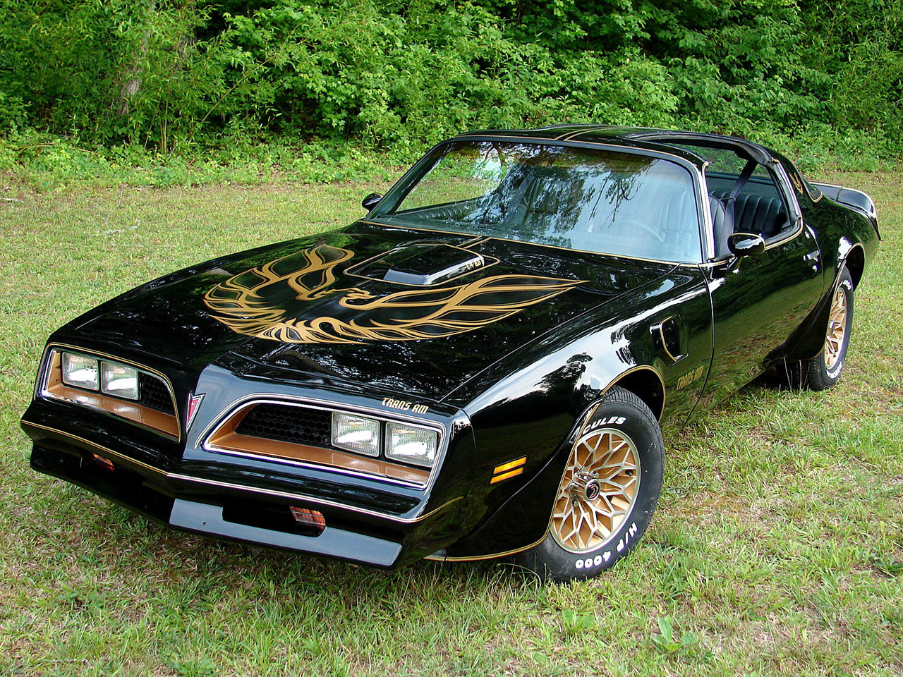
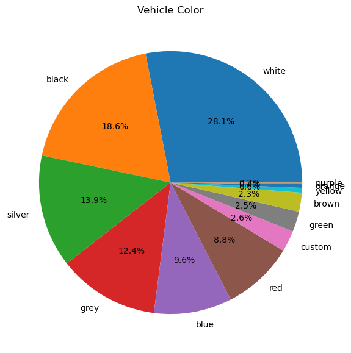
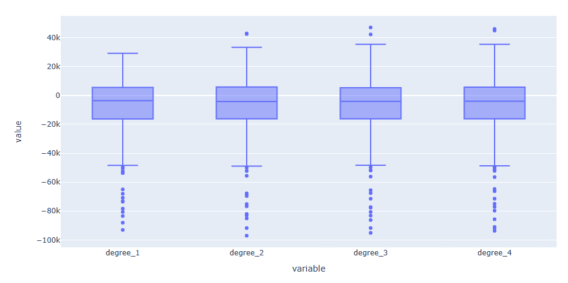
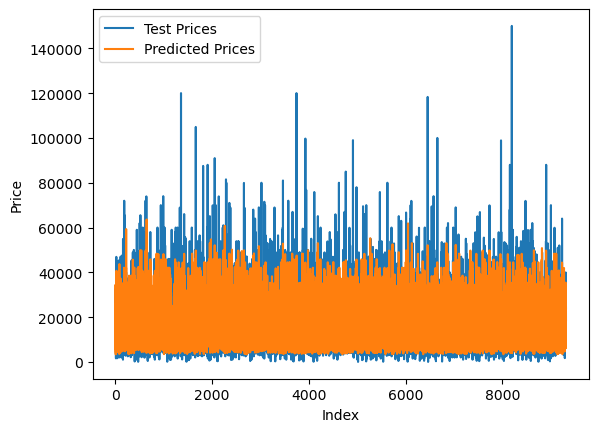
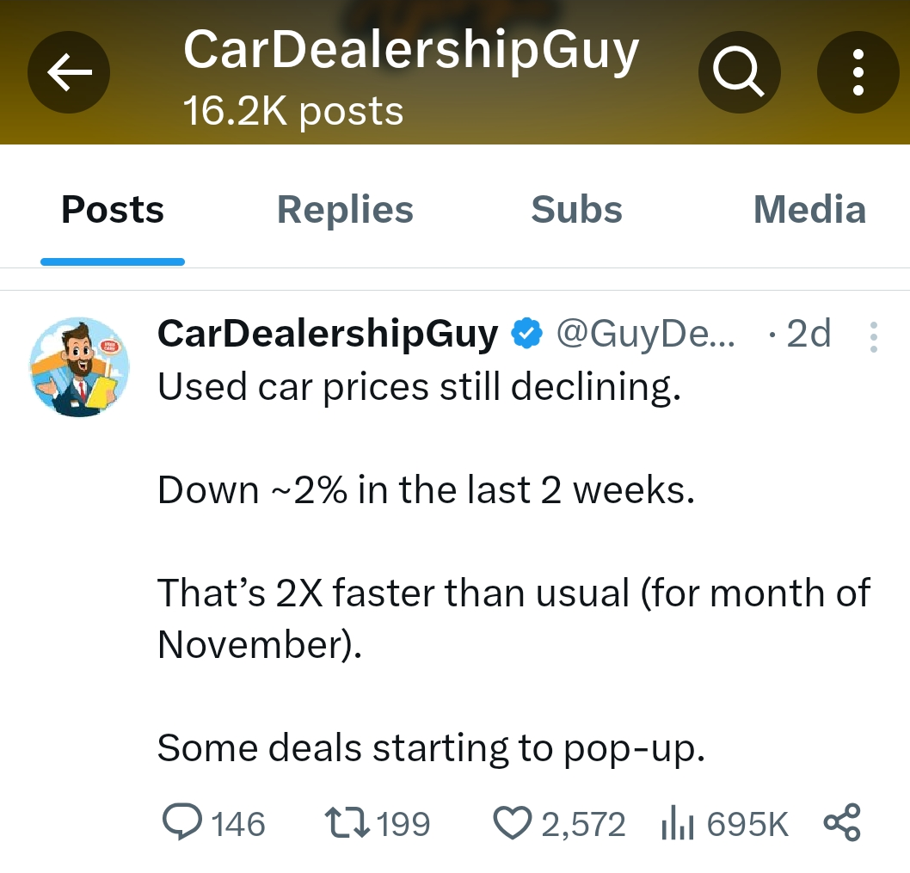
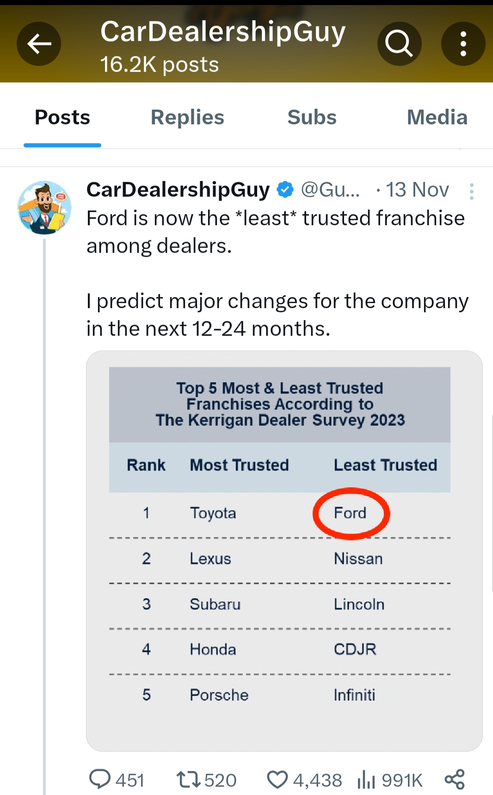

# Practical-Application-Assignment_11_1

## What Drives the Price of a Car?

## Context
### According to Perplexity:
##### The price of a car is determined by various factors, including the Manufacturer Suggested Retail Price (MSRP), mileage, condition, location, options, and color. The MSRP is the base price set by the manufacturer, which can be further influenced by additional features and add-on products. Mileage and condition are the primary factors affecting a used vehicle's price, with options, location, and color also playing a role. Other factors such as trim level, optional equipment, and the region where the car is being sold also contribute to the price.

## Business Understanding
#### Many of the features in the dataset provided for this project are described in the "Data Understanding".  We can leverage and tweak them to find the best model and price estimates.  The initial focus will be to build a codebase that can be leveraged with modifications afterwards.

## Data Understanding

### Data Descriptions
#### Here is the preliminary info about our dataset.
    RangeIndex: 426880 entries, 0 to 426879\n
    Data columns (total 18 columns):
        Column        Non-Null Count   Dtype  
    ---  ------        --------------   -----  
    0   id            426880 non-null  int64  
    1   region        426880 non-null  object 
    2   price         426880 non-null  int64  
    3   year          425675 non-null  float64
    4   manufacturer  409234 non-null  object 
    5   model         421603 non-null  object 
    6   condition     252776 non-null  object 
    7   cylinders     249202 non-null  object 
    8   fuel          423867 non-null  object 
    9   odometer      422480 non-null  float64
    10  title_status  418638 non-null  object 
    11  transmission  424324 non-null  object 
    12  VIN           265838 non-null  object 
    13  drive         296313 non-null  object 
    14  size          120519 non-null  object 
    15  type          334022 non-null  object 
    16  paint_color   296677 non-null  object 
    17  state         426880 non-null  object 
    dtypes: float64(2), int64(2), object(14)
    memory usage: 58.6+ MB

#### Here are some Pie Charts that show proportions in the some of the features.
#### These will be useful later during my insights.

#### Here are some Heatmaps visualizing the magnitude of individual values.
##### We can see that "odometer" has a negative correlation with price (-0.4) and model year (-0.47).
##### We can see that "drive" has a negative correlation with price (-0.18) and model year (-0.12).
##### We can see that "size" has a negative correlation with price (-0.088) and model year (-0.075).
##### These features will be dropped.

##### Here is the Heat Map that will drive the selection of features for our modeling.

### Modeling
#### Using "train_test_split" on the data we derived from the Heatmaps, we end up with 
    21,733 records for training
    9,314 records for testing

#### Applying Linear Regression
    Coefficients: 
    [5.75105537e-01 3.00495003e+03 3.26941663e+02 5.24749893e+02]
    Intercept: 0.00
    Mean squared error: 149,420,617.16
    Mean absolute error: 9,153.10
    R2 Score: 0.12

#### Applying Lasso
    Coefficients:
    [1487.78153216 3784.29067093  237.87201826  407.27009612]
    Intercept: -2,994,567.65
    Mean squared error: 95,599,902.58
    Mean absolute error: 6,871.82
    R2 Score: 0.44

#### Applying Ridge with alpha=0.10
    Coefficients:
    [1487.78662594 3784.33990351  237.87455949  407.33792712]
    Intercept: -2,994,578.21
    Mean squared error: 95,599,902.57
    Mean absolute error: 6,871.82
    R2 Score: 0.44

#### With Intercept: 0, Plain Linear Regression is the best option
#### Here is the Box Plot for that model

#### Something unsusal appears when we plot the Test Prices vs Predicted Prices
##### The Price Predictions in orange are much shorter than the Test Prices.

##### But there NO NEGATIVE price predctions!

#### Applying Polynomial Feature Selection with Degree = 4
    Intercept: -7,498,424,291.24
    Mean squared error: 64,791,763.31
    Mean absolute error: 5,413.84
    R2 Score: 0.62

#### Applying Ridge with alpha=0.10
    Intercept: -7,039,740,390.37
    Mean squared error: 64,871,764.62
    Mean absolute error: 5,419.70
    R2 Score: 0.62

#### Applying Ridge with alpha=1.0
    Intercept: -6,930,278,059.67
    Mean squared error: 64,917,351.23
    Mean absolute error: 5,421.55
    R2 Score: 0.62

#### Applying Ridge with alpha=10.0
    Intercept: -6,093,683,908.14
    Mean squared error: 65,237,594.85
    Mean absolute error: 5,444.64
    R2 Score: 0.62

#### Building a DataFrame to organize our Model Predictions we can produce Box Plot diagrams

#### When we run Simple Cross Validation, the results indicate that the Polynomial Degree 4 is the best option.
#### The Complexity that Minimized Test Error is also 4.

#### However, something unsusal appears when we plot the Test Prices vs Predicted Prices for Degree 2.
##### The Price Predictions in orange are a little bit shorter than the Test Prices, but better than the predictions from Plain Linear Regression.

##### However, there NO NEGATIVE price predctions!

### Evaluation
    Standard Feature selection produces
        best R2: 0.12
        worst Mean squared error: 149,420,617.16
        worst Mean absolute error: 9,153.10
    The R2=0.12 indicates a good fit with the observed data compared with the other R2 scores.

### Insights
##### The only insights I can think of is to reference the experts.
##### Car Dealership Guy on Twitter has his finger on the pulse of car sales.
https://twitter.com/GuyDealership

### Used car prices are declining 

### Ford has the least trusted branch

### Chevy is offering BIG incentives to move trucks

### Telsa is planning to start selling cars on Carsdotcom.

### Hyundai is planning to start selling cars on Amazon.

### Hybrids are out selling EVs

### And the worst news for last...
### Interest Rates on Inventory Floorplans are through the roof!

## Next steps and recommendations
    I recommend a cautious approach to build your inventory.
    Your sales people can tell you what shoppers are saying and how they feel about what's for sale.
    Price those vehicles strategically to get the most profit.
    Leverage your network of financers to get the reasonable interest rates to maximize your cash floor.

## Link to notebook
### https://github.com/jiml-mlai-bootcamp-ucberkeley/Practical-Application-Assignment_11_1