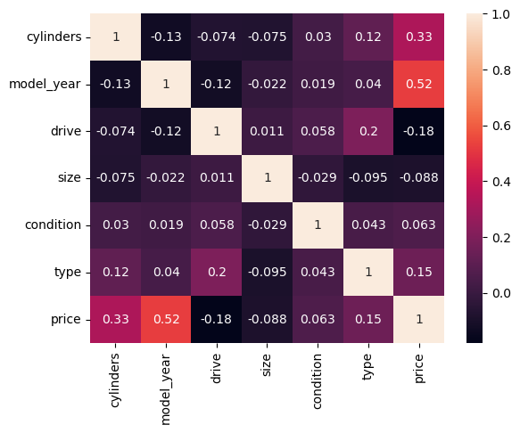

# Practical-Application-Assignment_11_1

## What Drives the Price of a Car?

## Context

## Business Understanding

## Data Understanding

### Data Descriptions

DataFrame.info()
RangeIndex: 426880 entries, 0 to 426879
Data columns (total 18 columns):
 #   Column        Non-Null Count   Dtype  
---  ------        --------------   -----  
 0   id            426880 non-null  int64  
 1   region        426880 non-null  object 
 2   price         426880 non-null  int64  
 3   year          425675 non-null  float64
 4   manufacturer  409234 non-null  object 
 5   model         421603 non-null  object 
 6   condition     252776 non-null  object 
 7   cylinders     249202 non-null  object 
 8   fuel          423867 non-null  object 
 9   odometer      422480 non-null  float64
 10  title_status  418638 non-null  object 
 11  transmission  424324 non-null  object 
 12  VIN           265838 non-null  object 
 13  drive         296313 non-null  object 
 14  size          120519 non-null  object 
 15  type          334022 non-null  object 
 16  paint_color   296677 non-null  object 
 17  state         426880 non-null  object 
dtypes: float64(2), int64(2), object(14)
memory usage: 58.6+ MB

DataFrame.describe()
#	id	price	year	odometer
count	4.268800e+05	4.268800e+05	425675.000000	4.224800e+05
mean	7.311487e+09	7.519903e+04	2011.235191	9.804333e+04
std	4.473170e+06	1.218228e+07	9.452120	2.138815e+05
min	7.207408e+09	0.000000e+00	1900.000000	0.000000e+00
25%	7.308143e+09	5.900000e+03	2008.000000	3.770400e+04
50%	7.312621e+09	1.395000e+04	2013.000000	8.554800e+04
75%	7.315254e+09	2.648575e+04	2017.000000	1.335425e+05
max	7.317101e+09	3.736929e+09	2022.000000	1.000000e+07

DataFrame.isnull().sum()
id                   0
region               0
price                0
year              1205
manufacturer     17646
model             5277
condition       174104
cylinders       177678
fuel              3013
odometer          4400
title_status      8242
transmission      2556
VIN             161042
drive           130567
size            306361
type             92858
paint_color     130203
state                0

# Feature         Unique Values  
--------------    --------------
  id              426,880
  region          404
  price           15,655
  year            114
  manufacturer    42
  model           29649
  condition       6
  cylinders       8
  fuel            5
  odometer        104,870
  title_status    6
  transmission    3
  VIN             118,246
  drive           3
  size            4
  type            13
  paint_color     12
  state           51
  model_year      

### Data Preparation
#### "id" and "VIN" have no value in predicting vehicle prices.  These will be discarded.
#### "model" has too many values to be useful, so it will be discarded.
#### "year" has 114 unique values that could be trimmed.
##### 2022 has 1, so we can discard that row.
##### The difference between 1995(62) and 1996(97) is 35 which is significant.
##### I will discard all the rows before 1996.
##### $0 prices shouldn't be considered an actual sale.  Those will be discarded.
##### $1 is typically a nominal amount that is 'paid' and not a real value.  Those will be discarded.

#### This is what we end up with going forward.
Int64Index: 31048 entries, 215 to 426833
Data columns (total 18 columns):
 #   Column        Non-Null Count  Dtype  
---  ------        --------------  -----  
 0   id            31048 non-null  int64  
 1   region        31048 non-null  object 
 2   price         31048 non-null  int64  
 3   manufacturer  31048 non-null  object 
 4   model         31048 non-null  object 
 5   condition     31048 non-null  object 
 6   cylinders     31048 non-null  object 
 7   fuel          31048 non-null  object 
 8   odometer      31048 non-null  float64
 9   title_status  31048 non-null  object 
 10  transmission  31048 non-null  object 
 11  VIN           31048 non-null  object 
 12  drive         31048 non-null  object 
 13  size          31048 non-null  object 
 14  type          31048 non-null  object 
 15  paint_color   31048 non-null  object 
 16  state         31048 non-null  object 
 17  model_year    31048 non-null  int64  
dtypes: float64(1), int64(3), object(14)
memory usage: 4.5+ MB

#### Here are some Pie Charts that show proportions in the features selected.

#### Here are some Kernel Density Estimate plots visualizing the distribution of observations for the features selected.

#### Here are some Heatmaps visualizing the magnitude of individual values.
##### We can see that "odometer" has a negative correlation with price (-0.4) and model year (-0.47).
##### This feature will be dropped.

##### We can see that "drive" has a negative correlation with price (-0.18) and model year (-0.12).
##### This feature will be dropped.

##### We can see that "size" has a negative correlation with price (-0.088) and model year (-0.075).
##### This feature will be dropped.

##### Here is the Heat Map that will drive the selection of features for our modeling.

<class 'pandas.core.frame.DataFrame'>
Int64Index: 31048 entries, 215 to 426833
Data columns (total 5 columns):

 #   Column      Non-Null Count  Dtype
---  ------      --------------  -----
 0   cylinders   31048 non-null  int32
 1   model_year  31048 non-null  int64
 2   condition   31048 non-null  int32
 3   type        31048 non-null  int32
 4   price       31048 non-null  int64
dtypes: int32(3), int64(2)
memory usage: 2.1 MB

### Modeling
#### Using "train_test_split" on the data we derived from the Heatmaps, we end up with 
##### 21,733 records for training
#####  9,314 records for testing

#### Applying Linear Regression we get the following:
Coefficients: 
[5.75105537e-01 3.00495003e+03 3.26941663e+02 5.24749893e+02]
Intercept: 0
Mean squared error: 149,420,617.16

#### Applying Lasso we get 
Coefficients:
[1487.78153216 3784.29067093  237.87201826  407.27009612]
Intercept: -2,994,567.65
Mean squared error: 95,599,902.58

#### Applying Ridge we get
Coefficients:
[1487.78662594 3784.33990351  237.87455949  407.33792712]
Intercept: -2,994,578.21
Mean squared error: 95,599,902.57

#### With Intercept: 0, Plain Linear Regression is the best option
#### Here is the Box Plot for that model

#### Something unsusal appears when we plot the Test Prices vs Predicted Prices

### Evaluation
#### 

### Deployment
#### 

## Link to notebook
### https://github.com/jiml-mlai-bootcamp-ucberkeley/Practical-Application-Assignment_11_1